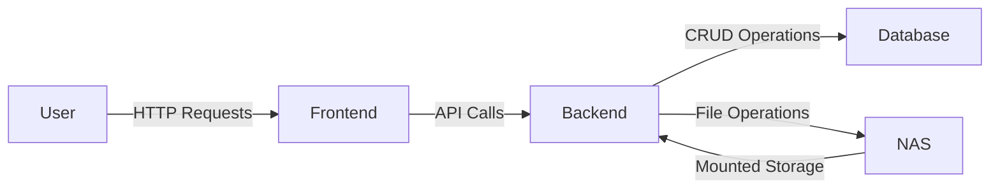

# Stoof
There are lots of apps out in the world that track inventory. The idea that makes this different is that I want specifically a way to track where things are during travel or other temporary locations. We were planning on traveling with a lot of stuff in pouches and pockets of our suitcases and backpacks. I thought it would be interesting to have an app that could tell you which pocket or subcompartment something is in.

I want this to be self hostable so that I can run it as a container on my NAS.

I also wanted to take this oppotunity to work on my software architecture and planning skills.

## User Stories
### As a user I want to
- Manage Items
    - Add, Remove, Update inventory items
    - View a list of all items
    - Filter, sort, search the items
    - Take photographs or upload pictures of items
    - Specify the location of items
    - Specify temporary locations
        - They can be made permanent or reverted once returned to original location
    - Define custom item categories
- Manage Locations
    - Add, Remove, Update inventory locations
    - View a list of all locations
    - Filter, sort, search the locations
    - View list of items by location
    - Take photographs or upload pictures of locations
        - Group photographs of same location to show sublocations
    - Define locations as a tree (parent/child)
    - Specify hotspots on images to show locations of sublocations
    - Define custom location categories

### Edge Cases
- Handling items of multiple quantities
    - Things like Chargers, Towels, Clothing, Paper Towel Rolls
    - Also things that are similar but different (different colors or brands, year models)

## Tech Stack
At its most basic, this is just a CRUD app. Naturally this should have a database to manage the items and locations. Since I'm going for simplicity, just going to use SQLite.
When storing pictures, this can just be a file server location that is mounted by the container.
### Tables
- Items
- Locations
- Pictures
- Categories
- PictureHotSpots
- ItemCategories
- ItemPictures
- LocationPictures
- PictureCategories

I'm most comfortable with C# therefore ASP.Net is what I'm going to choose for the backend service.

Front end does not have to be realtime. Sticking with simple Razor pages should be good enough.
The frontend will use a

## System Context Overview
At a high level, Stoof consists of:
- Users (interacting via a web UI)
- Frontend (Razor Pages UI)
- Backend (ASP.NET Core service)
- Database (SQLite for structured data)
- File Storage (NAS-mounted directory for images)
- Containerization (Docker for deployment)

### Actors & Components
**Actors (External Entities)**
- User: Interacts with Stoof via a web browser.
- NAS: Provides storage for images and hosts the containerized application.

**Core Components**
- Frontend (Razor Pages UI)
- Displays inventory and locations.
- Allows CRUD operations on items and locations.
- Handles image uploads and hotspot selection.
- Backend (ASP.NET Core API)
- Processes requests from the frontend.
- Manages SQLite database interactions.
- Handles file storage operations (saving/retrieving images).
- Implements business logic for temporary locations.
- Database (SQLite)
- Stores structured data (items, locations, categories, pictures).
- Supports search, filtering, and sorting.
- File Storage (NAS)
- Stores images associated with items and locations.
- Provides a mounted directory accessible by the container.

#### Key Interactions
- User adds an item
    - User interacts with the Frontend (Razor Pages UI).
    - Frontend sends a request to the Backend API.
    - Backend stores item details in SQLite and saves images to NAS.
- User searches for an item
    - Frontend sends a query to the Backend API.
    - Backend retrieves data from SQLite and returns results.
- User updates an item's location
    - Frontend sends an update request to the Backend API.
    - Backend modifies the item's location in SQLite.
- User views an item's image and selects hotspots
    - Frontend retrieves image from NAS via the Backend API.
    - User selects hotspots, which are stored in SQLite.
